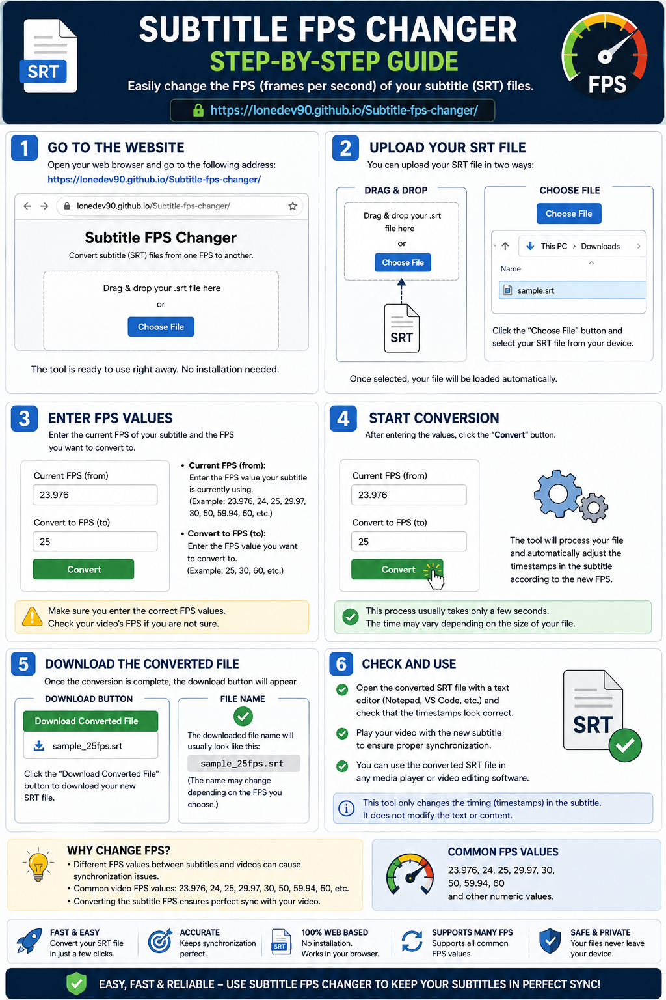

# Subtitle Fps Changer 🎬

[lonedev90.github.io/Subtitle-fps-changer/](https://lonedev90.github.io/Subtitle-fps-changer/)

---

## 📌 Usage Guide / Kullanım Kılavuzu

Bu proje, altyazı dosyalarınızın (.srt) zamanlamasını farklı FPS değerlerine (örneğin 24.000 FPS'den 25.000 FPS'ye) hızlı ve toplu bir şekilde dönüştürmenize olanak sağlayan web tabanlı bir araçtır.

## ✨ Özellikler

- **Toplu İşlem:** Birden fazla altyazı dosyasını aynı anda yükleyebilir ve dönüştürebilirsiniz.
- **Akıllı Paketleme:** Dönüştürülen dosyalar, orijinal dosya adı korunarak otomatik olarak bir `.zip` arşivi içinde sunulur.
- **Detaylı Raporlama:** Her işlem sonunda, zamanlamaların nasıl değiştiğini gösteren (Eski vs Yeni Süre) bir `Subtitle Fps Conversion Report.txt` dosyası oluşturulur.
- **Karakter Koruması:** ​Dosyalarınızın orijinal Türkçe karakter yapısı aynen korunur.
- **Modern Arayüz:** Kullanıcı dostu, logonuzla özelleştirilmiş ve 25x25px tile arka plan tasarımına sahip arayüz.
- **Sıfırlama Özelliği:** Sayfa yenilendiğinde (F5) tüm veriler ve form otomatik olarak temizlenir.

## 🚀 Nasıl Kullanılır?

1. **Sayfayı Açın:**
2. **Dosya Seçin:** "SRT Dosyalarını Seçin" butonu ile altyazılarınızı yükleyin.
3. **FPS Ayarlayın:** Kaynak (mevcut) FPS değerini ve dönüştürmek istediğiniz hedef FPS değerini seçin.
4. **Dönüştür:** "Dönüştür ve .ZIP İndir" butonuna tıklayın.
5. **Sonuç:** İşlem tamamlandığında `.zip` dosyanız otomatik olarak inecektir.

## 🛠 Teknik Detaylar

Bu araç aşağıdaki teknolojiler kullanılarak geliştirilmiştir:

- **HTML5 & CSS3:** Modern ve responsive tasarım.
- **JavaScript (Vanilla):** Hızlı ve sunucu taraflı işlem gerektirmeyen istemci tabanlı mantık.
- **JSZip:** Tarayıcı tarafında dosya paketleme (zipping) işlemleri için.
- **TextDecoder API:** Farklı dosya kodlamalarını (encoding) yönetmek için.

## 📁 Dosya Yapısı

- `index.html`: Ana uygulama dosyası.
- `subtitle fps changer.jpg`: Arka plan ve ikon için kullanılan görsel dosya.
- `Subtitle Fps Conversion Report.txt`: İşlem sonrası otomatik oluşturulan rapor dosyası.

---
*Bu proje, film ve dizi severlerin altyazı senkronizasyon sorunlarını en hızlı şekilde çözebilmesi için tasarlanmıştır.*

# 🎬 Subtitle FPS Changer

A high-performance, web-based tool designed to batch convert subtitle (.srt) files between different frame rates (FPS). Sync your subtitles perfectly with your video files in seconds.

## ✨ Key Features

- **Batch Processing:** Upload and convert multiple subtitle files simultaneously.
- **Smart Packaging:** Converted files are automatically bundled into a single `.zip` archive, named after your original file.
- **Detailed Reporting:** Generates a `Subtitle Fps Conversion Report.txt` for every batch, showing "Old vs New" timestamps for verification.

- **Modern & Responsive UI:** Featuring a custom tile background (25x25px) and a user-friendly interface optimized for all devices.
- **Auto-Reset Function:** The form and all progress data are fully cleared upon page refresh (F5).

## 🚀 How to Use?

1. **Visit the App:**
2. **Select Files:** Click the "Select Subtitles" button and upload your `.srt` files.
3. **Configure FPS:** Choose the **Source FPS** (current) and **Target FPS** (desired).
4. **Convert:** Click the "Convert and Download .ZIP" button.
5. **Download:** Your processed files and conversion report will be downloaded automatically as a zip file.

## 🛠 Technical Stack

Built with modern web technologies to ensure privacy and speed (all processing is done locally in your browser):

- **HTML5 & CSS3:** Semantic structure and custom styling.
- **Vanilla JavaScript:** Fast, client-side logic without server overhead.
- **JSZip:** High-speed client-side file compression.
- **TextDecoder API:** Advanced encoding management for subtitle readability.

## 📁 Repository Structure

- `index.html`: The main application entry point.
- `subtitle fps changer.jpg`: Visual assets for background and branding.
- `Subtitle Fps Conversion Report.txt`: Automatically generated log file within the ZIP.

---
*Developed to solve subtitle synchronization issues quickly and efficiently for the movie and TV show community.*
